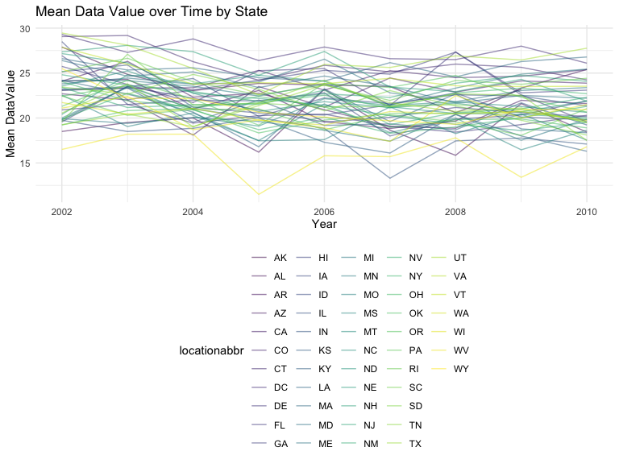
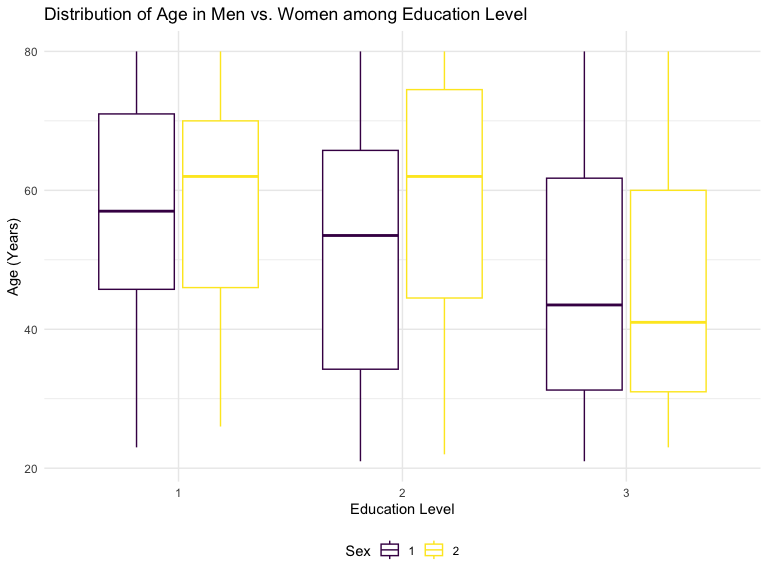
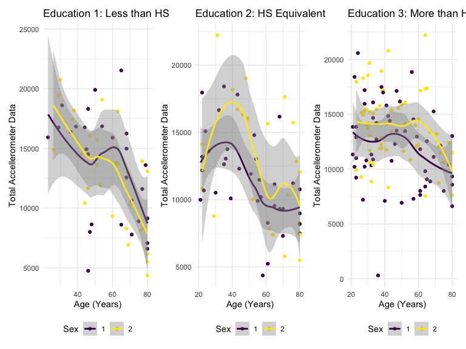
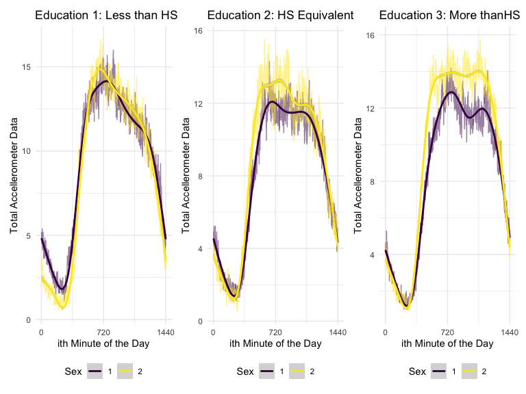

HW3: Markdown file
================
Kevin Liu
2023-09-30

# Problem \# 1

``` r
library(p8105.datasets)
data("instacart")
instacart = 
  instacart |> 
  as_tibble()
```

## Write a short description of the dataset,

…noting the size and structure of the data, describing some key
variables, and giving illstrative examples of observations.

- The dataset instacart contains 1384617 observations and 15 variables.

- The dataset describes some form of online ordering system that keeps
  track of what is purchase in one order, how many, and what product as
  well as where the product is located by store department and aisle.

- The dataset has many repeating rows for the same order and thus
  untidy, in the long form.

- Some key varaibles include the order_id (perhaps the designation for a
  certain shopper’s order), product_id (what the shopper ordered),
  user_id (designation for the shopper), department (the store
  department where the item is located), and aisle (the store aisle
  where the item is located).

- For example, here is the order for shopper 112108 with their order id
  1.

``` r
instacart |> 
  select(product_id, order_id, user_id, product_name, aisle, department) |> 
  head(8)
```

    ## # A tibble: 8 × 6
    ##   product_id order_id user_id product_name                      aisle department
    ##        <int>    <int>   <int> <chr>                             <chr> <chr>     
    ## 1      49302        1  112108 Bulgarian Yogurt                  yogu… dairy eggs
    ## 2      11109        1  112108 Organic 4% Milk Fat Whole Milk C… othe… dairy eggs
    ## 3      10246        1  112108 Organic Celery Hearts             fres… produce   
    ## 4      49683        1  112108 Cucumber Kirby                    fres… produce   
    ## 5      43633        1  112108 Lightly Smoked Sardines in Olive… cann… canned go…
    ## 6      13176        1  112108 Bag of Organic Bananas            fres… produce   
    ## 7      47209        1  112108 Organic Hass Avocado              fres… produce   
    ## 8      22035        1  112108 Organic Whole String Cheese       pack… dairy eggs

- There are 39123 products from 131209 orders from 131209 distinct
  users.

## Then, do or answer the following:

### How many aisles are there, and which aisles are the most items ordered from?

- There are 134 aisles.

The aisles that are the most ordered are:

``` r
instacart |> 
  count(aisle) |> 
  arrange(desc(n)) |>
  head(3)
```

    ## # A tibble: 3 × 2
    ##   aisle                           n
    ##   <chr>                       <int>
    ## 1 fresh vegetables           150609
    ## 2 fresh fruits               150473
    ## 3 packaged vegetables fruits  78493

### Make a plot that…

shows the number of items ordered in each aisle, limiting this to aisles
with more than 10000 items ordered. Arrange aisles sensibly, and
organize your plot so others can read it.

``` r
instacart |> 
  count(aisle) |> 
  filter(n > 10000) |> 
  mutate(aisle = fct_reorder(aisle, n)) |> 
  ggplot(aes(x = aisle, y = n)) + 
  geom_point() + 
  labs(title = "Number of items ordered in each aisle") +
  theme(axis.text.x = element_text(angle = 60, hjust = 1))
```


### Make a table…

showing the three most popular items in each of the aisles “baking
ingredients”, “dog food care”, and “packaged vegetables fruits”. Include
the number of times each item is ordered in your table.

``` r
instacart |> 
  filter(aisle %in% c("baking ingredients", "dog food care", "packaged vegetables fruits")) |>
  group_by(aisle) |> 
  count(product_name) |> 
  mutate(rank = min_rank(desc(n))) |> 
  filter(rank < 4) |> 
  arrange(desc(n)) |>
  knitr::kable()
```

| aisle                      | product_name                                  |    n | rank |
|:---------------------------|:----------------------------------------------|-----:|-----:|
| packaged vegetables fruits | Organic Baby Spinach                          | 9784 |    1 |
| packaged vegetables fruits | Organic Raspberries                           | 5546 |    2 |
| packaged vegetables fruits | Organic Blueberries                           | 4966 |    3 |
| baking ingredients         | Light Brown Sugar                             |  499 |    1 |
| baking ingredients         | Pure Baking Soda                              |  387 |    2 |
| baking ingredients         | Cane Sugar                                    |  336 |    3 |
| dog food care              | Snack Sticks Chicken & Rice Recipe Dog Treats |   30 |    1 |
| dog food care              | Organix Chicken & Brown Rice Recipe           |   28 |    2 |
| dog food care              | Small Dog Biscuits                            |   26 |    3 |

### Make a table…

showing the mean hour of the day at which Pink Lady Apples and Coffee
Ice Cream are ordered on each day of the week; format this table for
human readers (i.e. produce a 2 x 7 table).

``` r
instacart |>
  filter(product_name %in% c("Pink Lady Apples", "Coffee Ice Cream")) |>
  group_by(product_name, order_dow) |>
  summarize(mean_hour = mean(order_hour_of_day)) |>
  pivot_wider(
    names_from = order_dow, 
    values_from = mean_hour) |>
  knitr::kable(digits = 2)
```

    ## `summarise()` has grouped output by 'product_name'. You can override using the
    ## `.groups` argument.

| product_name     |     0 |     1 |     2 |     3 |     4 |     5 |     6 |
|:-----------------|------:|------:|------:|------:|------:|------:|------:|
| Coffee Ice Cream | 13.77 | 14.32 | 15.38 | 15.32 | 15.22 | 12.26 | 13.83 |
| Pink Lady Apples | 13.44 | 11.36 | 11.70 | 14.25 | 11.55 | 12.78 | 11.94 |

# Problem \#2

``` r
#Import brfss data and convert into tibble dataframe
data("brfss_smart2010")
brfss_smart2010 = 
  brfss_smart2010 |> 
  as_tibble()
```

### **First**, do some data cleaning:

- format the data to use appropriate variable names;

``` r
#Convert variable names into snakecase
brfss_smart2010 =
  brfss_smart2010 |> 
  janitor::clean_names()
```

- focus on the “Overall Health” topic

``` r
#Filter responses where topic == "OVerall Health Only"
brfss_overall_health =
  brfss_smart2010 |> 
  filter(topic == "Overall Health")
```

- include only responses from “Excellent” to “Poor”:

``` r
#Filter to include only responses that contain "Excellent", "Very good", "Good", "Fair", "Poor"
brfss_overall_health = 
  brfss_overall_health |> 
  filter(response == "Poor" | 
           response == "Fair" | 
           response == "Good" | 
           response == "Very good" | 
           response == "Excellent"
         )
```

- organize responses as a factor taking levels ordered from “Poor” to
  “Excellent”:

``` r
#Convert variable type from char to factor
brfss_overall_health =
  brfss_overall_health |> 
  mutate(response = factor(
    response, 
    #we define the levels to have the 5 response types.
    levels = c ("Poor", "Fair", "Good", "Very good", "Excellent"), 
    #the categorical variable "response" is ordered so we indicate it as so
    ordered = TRUE)
    ) 
```

### Using this dataset, do or answer the following:

In 2002, which states were observed at 7 or more locations? What about
in 2010?

``` r
state20027cnt = 
  brfss_overall_health |> 
  filter(year == 2002) |>   #filter to include responses in 2002 only
  group_by(locationabbr) |>  #group by the state abbreviations
  summarize(num = n()) |>    #summarize the different response types 
  mutate(num = num/5) |>     #we know that there are 5 responses per location so we can get the number by                                   dividing
  arrange(desc(num))         #arrange by descending order for viewing ease

#output a table that shows stsates that have more than 7 locations and a state that had 6
state20027cnt |> 
  head(7) |> 
  knitr::kable(digits = 2)
```

| locationabbr | num |
|:-------------|----:|
| PA           |  10 |
| MA           |   8 |
| NJ           |   8 |
| CT           |   7 |
| FL           |   7 |
| NC           |   7 |
| MD           |   6 |

- In 2002, PA, MA, NJ, CT, FL, and NC were states that were observed at
  7 or more locations

``` r
state20107cnt = 
  brfss_overall_health |> 
  filter(year == 2010) |>   #filter to include responses in 2010 only
  group_by(locationabbr) |>  #group by the state abbreviations
  summarize(num = n()) |>    #summarize the different response types 
  mutate(num = num/5) |>     #we know that there are 5 responses per location so we can get the number by                                   dividing
  arrange(desc(num))         #arrange by descending order for viewing ease

#output a table that shows stsates that have more than 7 locations and a state that had 6
state20107cnt |>
  head(15) |> 
  knitr::kable(digits = 2)
```

| locationabbr | num |
|:-------------|----:|
| FL           |  41 |
| NJ           |  19 |
| TX           |  16 |
| CA           |  12 |
| MD           |  12 |
| NC           |  12 |
| NE           |  10 |
| WA           |  10 |
| MA           |   9 |
| NY           |   9 |
| OH           |   8 |
| CO           |   7 |
| PA           |   7 |
| SC           |   7 |
| ID           |   6 |

- In 2010, FL, NJ, TX, CA, MD, NC, NE, WA, MA, NY, OH, CO, PA, and SC,
  were states that were observed at 7 or more locations.

### Construct a dataset that is limited to…

Excellent responses, and contains, year, state, and a variable that
averages the `data_value` across locations within a state. Make a
“spaghetti” plot of this average value over time within a state (that
is, make a plot showing a line for each state across years – the
geom_line geometry and group aesthetic will help).

``` r
brfss_avg = 
  brfss_overall_health |> 
  select(year, locationabbr, response, data_value) |>
  filter(response == "Excellent") |> 
  group_by(year, locationabbr) |> 
  summarize(mean_data = mean(data_value, na.rm = TRUE))
```

    ## `summarise()` has grouped output by 'year'. You can override using the
    ## `.groups` argument.

``` r
brfss_avg |> 
  ggplot(aes(x = year, y = mean_data)) + 
  geom_line(aes(color = locationabbr), alpha = .5) +
  labs(
    title = "Mean Data Value over Time by State",
    x = "Year" ,
    y = "Mean DataValue",
  )
```



### Make a two-panel plot showing…

for the years 2006, and 2010, distribution of data_value for responses
(“Poor” to “Excellent”) among locations in NY State.

``` r
#NY in 2006
brfssNY2006 =
  brfss_overall_health |> 
  filter(year == 2006) |> 
  filter(locationabbr == "NY")

#Plot
brfssNY2006plot = 
  brfssNY2006 |> 
  ggplot(aes(x = response, y = data_value)) +
  geom_boxplot(aes(fill = response)) + 
  labs(
    title = "Distribution between responses among locations \n in NY: 2006",
    x = "Response (Poor to Excellent)" ,
    y = "Data Value Recorded",
  )

#NY in 2010
brfssNY2010 =
  brfss_overall_health |> 
  filter(year == 2010) |> 
  filter(locationabbr == "NY")

brfssNY2010plot =
  brfssNY2010 |> 
  ggplot(aes(x = response, y = data_value)) +
  geom_boxplot(aes(fill = response)) +
  labs(
    title = "Distribution between responses among locations \n in NY: 2006",
    x = "Response (Poor to Excellent)" ,
    y = "Data Value Recorded",
  )
  

brfssNY2006plot + brfssNY2010plot
```


# Problem 3

``` r
#Import data + clean

#Retains the variable labels/details
demo_raw = 
  read_csv("./data/nhanes_covar.csv") |> 
  janitor::clean_names()
```

    ## New names:
    ## Rows: 254 Columns: 5
    ## ── Column specification
    ## ──────────────────────────────────────────────────────── Delimiter: "," chr
    ## (5): ...1, 1 = male, ...3, ...4, 1 = Less than high school
    ## ℹ Use `spec()` to retrieve the full column specification for this data. ℹ
    ## Specify the column types or set `show_col_types = FALSE` to quiet this message.
    ## • `` -> `...1`
    ## • `` -> `...3`
    ## • `` -> `...4`

``` r
demo = 
  read_csv("./data/nhanes_covar.csv", skip = 4) |> 
  janitor::clean_names()
```

    ## Rows: 250 Columns: 5
    ## ── Column specification ────────────────────────────────────────────────────────
    ## Delimiter: ","
    ## dbl (5): SEQN, sex, age, BMI, education
    ## 
    ## ℹ Use `spec()` to retrieve the full column specification for this data.
    ## ℹ Specify the column types or set `show_col_types = FALSE` to quiet this message.

``` r
accel = 
  read_csv("./data/nhanes_accel.csv") |> 
  janitor::clean_names()
```

    ## Rows: 250 Columns: 1441
    ## ── Column specification ────────────────────────────────────────────────────────
    ## Delimiter: ","
    ## dbl (1441): SEQN, min1, min2, min3, min4, min5, min6, min7, min8, min9, min1...
    ## 
    ## ℹ Use `spec()` to retrieve the full column specification for this data.
    ## ℹ Specify the column types or set `show_col_types = FALSE` to quiet this message.

## Load, tidy, merge, and otherwise organize the data sets.

Your final dataset should include all originally observed variables;
exclude participants less than 21 years of age, and those with missing
demographic data; and encode data with reasonable variable classes
(i.e. not numeric, and using factors with the ordering of tables and
plots in mind).

``` r
#Tidy 

## Tidy Accel (Long)
accel_wide = 
  accel |> 
  pivot_longer(
    min1:min1440,
    names_to = "minuteofday", 
    values_to = "mimsaccel",
    names_prefix = "min")
```

- We tidy accel in order to allow it to merge with demo data.

``` r
## Filter Demo
demo_filter =
  demo |>
  
  #Filter
  filter(age >= 21) |> #keep those that are 21 y/o or older
  filter(!is.na(education)) |> #filter out missing demograph (education) data
  filter(!is.na(sex)) |> 
  
  #Factor - Education
  mutate(education = factor(
    education, 
    #we define the levels to have 3 education categories
    levels = c (1, 2, 3), 
    #the categorical variable "education" is ordered so we indicate it as so
    ordered = TRUE)
    ) |> 
  
  #Factor - Gender
  mutate(sex = factor(
    sex,
    levels = c (1,2),
    ordered = TRUE)
  )
```

- Filter out \<21 y/o and missing demographic (eduation) variables
- Apply factors to categorical variables, sex and education.

``` r
#Merge
accel_demo =
  left_join(demo_filter, accel_wide, by = "seqn") |> 
  
  #Factor - minsofday (It is like a short continuous but I Just store in factors because it's ordered)
  mutate(minuteofday = as.numeric(minuteofday))
```

## Produce a reader-friendly table…

for the number of men and women in each education category, and create a
visualization of the age distributions for men and women in each
education category. Comment on these items.

``` r
#Plot
  demo_filter |> 
  ggplot(aes(x = education, y = age, color = sex)) +
  geom_boxplot() +
  labs(
    title = "Distribution of Age in Men vs. Women among Education Level",
    x = "Education Level",
    y = "Age (Years)",
    color = "Sex",
  )
```



- It seems that those that have attained a higher education level, are
  younger in age.

## Traditional analyses of accelerometer data focus on the total activity over the day.

Using your tidied dataset, aggregate across minutes to create a total
activity variable for each participant. Plot these total activities
(y-axis) against age (x-axis); your plot should compare men to women and
have separate panels for each education level. Include a trend line or a
smooth to illustrate differences. Comment on your plot.

``` r
#Clean Data
total_activity = 
  accel_demo |> 
  group_by(seqn,age, education, sex) |> 
  summarize(sum_mim = sum(mimsaccel))
```

    ## `summarise()` has grouped output by 'seqn', 'age', 'education'. You can
    ## override using the `.groups` argument.

``` r
#plot
#Separate into 3 Education GRoups (in order to plot panels)
education1 = 
  total_activity |> 
  filter(education == 1) |> 
  ggplot(aes(x = age, y = sum_mim, color = sex)) +
  geom_point() +
  geom_smooth() + 
  labs(
    title = "Education 1: Less than HS",
    x = "Age (Years)",
    y = "Total Accellerometer Data",
    color = "Sex",
  )

education2 =
  total_activity |> 
  filter(education == 2) |> 
  ggplot(aes(x = age, y = sum_mim, color = sex)) +
  geom_point() +
  geom_smooth() + 
  labs(
    title = "Education 2: HS Equivalent",
    x = "Age (Years)",
    y = "Total Accellerometer Data",
    color = "Sex",
  )

education3 = 
  total_activity |> 
  filter(education == 3) |> 
  ggplot(aes(x = age, y = sum_mim, color = sex)) +
  geom_point() +
  geom_smooth() + 
  labs(
    title = "Education 3: More than HS",
    x = "Age (Years)",
    y = "Total Accellerometer Data",
    color = "Sex",
  )

education1 + education2 + education3
```

    ## `geom_smooth()` using method = 'loess' and formula = 'y ~ x'
    ## `geom_smooth()` using method = 'loess' and formula = 'y ~ x'
    ## `geom_smooth()` using method = 'loess' and formula = 'y ~ x'



- For all 3 education groups there is an overall decreasing trend in
  total accelerometer activity as age increases.
- For education groups 2 and 3, it seems like the total accerometer
  activity in females is a bit higher than males

## Make a three-panel plot…

that shows the 24-hour activity time courses for each education level
and use color to indicate sex. Describe in words any patterns or
conclusions you can make based on this graph; including smooth trends
may help identify differences.

``` r
#Clean Data
accel_overtime = 
  accel_demo |> 
  group_by(minuteofday, education, sex) |> 
  summarize(mean_min = mean(mimsaccel))
```

    ## `summarise()` has grouped output by 'minuteofday', 'education'. You can
    ## override using the `.groups` argument.

``` r
#plot data
edu1time = 
  accel_overtime |> 
  filter(education == 1) |> 
  ggplot(aes(x = minuteofday, y = mean_min, color = sex)) +
  geom_line(alpha = 0.5) + 
  geom_smooth() +
  labs(
    title = "Education 1: Less than HS",
    x = "ith Minute of the Day",
    y = "Total Accellerometer Data",
    color = "Sex",
  ) + 
  scale_x_continuous(
    breaks = c(0, 720, 1440), 
    labels = c("0", "720", "1440")
  )

edu2time = 
  accel_overtime |> 
  filter(education == 2) |> 
  ggplot(aes(x = minuteofday, y = mean_min, color = sex)) +
  geom_line(alpha = 0.5) + 
  geom_smooth() +
  labs(
    title = "Education 2: HS Equivalent",
    x = "ith Minute of the Day",
    y = "Total Accellerometer Data",
    color = "Sex",
  ) + 
  scale_x_continuous(
    breaks = c(0, 720, 1440), 
    labels = c("0", "720", "1440")
  )


edu3time = 
  accel_overtime |> 
  filter(education == 3) |> 
  ggplot(aes(x = minuteofday, y = mean_min, color = sex)) + 
  geom_line(alpha = 0.5) + 
  geom_smooth() +
  labs(
    title = "Education 3: More thanHS",
    x = "ith Minute of the Day",
    y = "Total Accellerometer Data",
    color = "Sex",
  ) + 
  scale_x_continuous(
    breaks = c(0, 720, 1440), 
    labels = c("0", "720", "1440")
  )
 

edu1time + edu2time + edu3time
```

    ## `geom_smooth()` using method = 'gam' and formula = 'y ~ s(x, bs = "cs")'
    ## `geom_smooth()` using method = 'gam' and formula = 'y ~ s(x, bs = "cs")'
    ## `geom_smooth()` using method = 'gam' and formula = 'y ~ s(x, bs = "cs")'



- Among those with Education Level 1, it seems that male and females
  generally have similar activities throughout the day except for during
  the beginning quarter of the day where males are a little more active
  and towards the end, females slightly are more active

- Ïor education levels 2 and 3, there are similar trends. During the
  beginning of the day, activity is similar among males and females
  however as the day progresses into middle of day, females are more
  active than males until the day ends.
